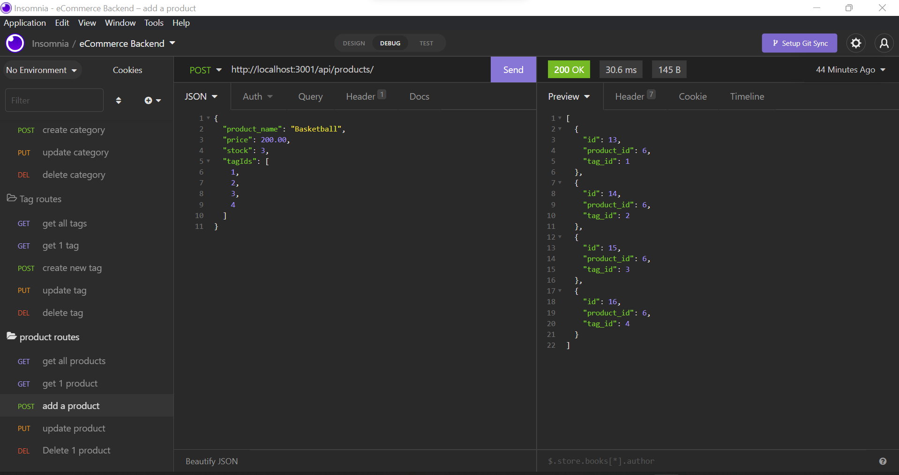

# Module 13, Object-Relational Mapping (ORM) Challenge: E-commerce Back End, Due 6/15/2022

  ## Description
  
  This is the refactored code for assigment 13, due on 6/15/2022. It is a fully functioning eCommerce backend without any tie in to a front end.
  
  ## License
  
  Developed under Mit License 
  
  ## Table of Contents
  
  - [Description](#description)
  - [Installation](#installation)
  - [Usage](#usage)
  - [Contributing](#contributing)
  - [License](#license)
  - [Test Instructions](#testing)
  
  ## Installation
  
  1. Clone the code from the github repo. 
  2. Run "npm i" in your node terminal. 
  3. Create the database with the command "SOURCE db/schema.sql" in your mySql terminal. 
  4. Seed the database with the command "npm run seed" in node terminal. 
  5. To start the server, execute "npm start"
  
  [Install and Usage Video](https://youtu.be/ChIUrr72iI8 "Install and Usage Video")
  
  
  
  ## Usage
  
  This is a simple eCommerce backend that could be used for handling basic inventory control with relational links to descriptive tags.
  
  ## Screenshot
  
  
  
  ## Contributing
  
  Contact me at the email below if you would like to contribute.
  
  ## Testing
  
  Import the test_routes.json file from the assets folder to Insomnia to test all of the available routes.
  
  ---
  
  ## My GitHub
  
  [CaseySMiller](https://github.com/CaseySMiller)
  
  ## Email me
  
  [CaseySMiller@yahoo.com](mailto:CaseySMiller@yahoo.com)

